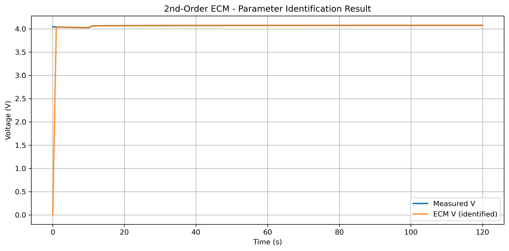
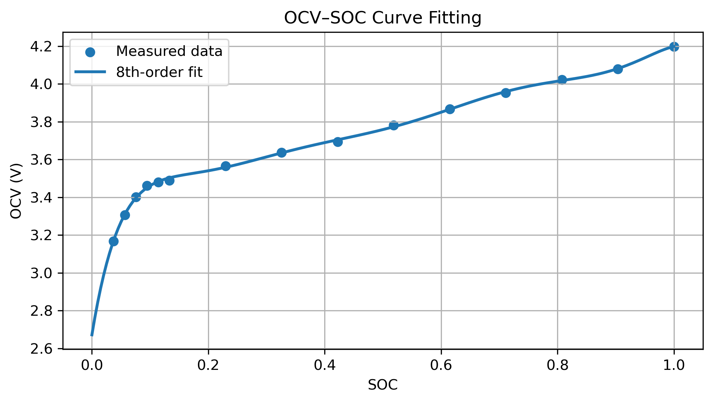

# Battery Simulation Project

### OCV Modeling • SOC Estimation • 2nd-Order ECM • Parameter Identification

## Table of Contents

* [Overview](#-overview)
* [Project Objectives](#-project-objectives)
* [Project Structure](#-project-structure)
* [Results](#-results)

---

## 📘 Overview

> ### 💡 Highlight
>
> This project implements a **complete battery cell modeling workflow**, including:
> • Open-Circuit Voltage (OCV) modeling
> • SOC estimation by Coulomb Counting
> • 2nd-order Equivalent Circuit Model (ECM)
> • Nonlinear parameter identification using least squares
>
> It is developed for coursework in **Battery System Modeling and Simulation** and is structured as a reusable, modular Python package.

The project processes real experimental discharge data (`Profile.xlsx`), builds an OCV model, estimates SOC, simulates an ECM, and identifies optimal electrical parameters for accurate terminal-voltage prediction.
---

## Project Objectives

### **1. Fit an OCV–SOC Curve from Experimental Data**

* Loads experimental OCV–SOC points
* Fits an **8th-order polynomial model**
* Computes **Mean Absolute Error (MAE)**
* Produces OCV(SOC) model for use in ECM simulation
---
### **2. Load Experimental Discharge Profile**

* Reads time, current, and voltage from `Profile.xlsx`
* Converts timestamp → seconds
* Computes sampling period `dt`

---

### **3. Estimate SOC Over Time**

* Implements **Coulomb Counting**
* Includes Coulombic efficiency
* SOC constrained to **[0, 1]**

---

### **4. Simulate a 2nd-Order ECM**

* Includes **R0 + two RC branches (R1C1, R2C2)**
* Uses exact exponential discrete-time update
* Produces terminal voltage prediction

---

### **5. Identify ECM Parameters**

* Nonlinear least-squares optimization (`scipy.optimize.least_squares`)
* Identifies: **R0, R1, C1, R2, C2**
* Minimizes voltage error between simulated and measured data
* Reports optimal parameters + final MAE
---

## 📁 Project Structure

```
battery-simulation/
││
├── images/
│     ├── ocv_fit.png
│     ├── ecm_parameters.png
│
├── data/
│   └── Profile.xlsx                # Experimental discharge dataset
│
├── src/
│   ├── battery_model/
│   │   ├── ocv_model.py            # OCV(SOC) model using polynomial fit
│   │   ├── soc_update.py           # Coulomb counting SOC estimator
│   │   ├── ecm_2ndorder.py         # 2nd-order ECM simulation
│   │   ├── parameter_id.py         # Nonlinear least-squares identification
│   │   └── model_spec.txt          # Human-readable model equations
│   │
│   ├── ocv_fit.py                  # Polynomial fitting + plotting
│   ├── load_profile.py             # Reads and preprocesses Excel data
│   └── soc_update.py               # Standalone SOC estimation script
│
├── notebook/                       # (Optional) Jupyter notebooks
│
└── README.md                       # Project documentation
```

---

## 📊 Results

### **OCV Fit**

* Polynomial order: 8
* MAE ~ **0.005 V**

### **ECM Parameter Identification**

Identified values (example):

| Parameter | Value      |
| --------- | ---------- |
| R0        | 0.025964 Ω |
| R1        | 0.010218 Ω |
| C1        | 1154.21 F  |
| R2        | 0.054695 Ω |
| C2        | 2595.93 F  |

Voltage prediction error:

> **ECM MAE (sim vs meas): ~0.000504 V**

### Example ECM Plot




```

---

### Academic Note

This repository is developed for **Battery System Modeling** coursework and demonstrates understanding of OCV modeling, SOC estimation, equivalent circuit modeling, and nonlinear optimization techniques.
